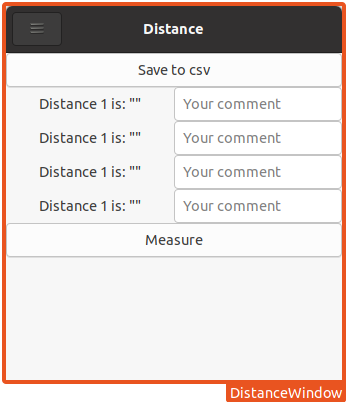

# Distance

Starting from here:  
The documentation for this example can be found in the [Librem 5 developer
documentation](https://developer.puri.sm/Librem5/Apps/Examples/).

We try to make a tool, that:

- Uses GTK because we want to get it on the librem5 and pinephone
- Integrates sensors and external measure tools for measuring distances in general
- Tries to be generic

Thats it lets see.

So a first Mockup could look like this:

One module that should be able to integrate is the

[BOSCH-GLM-rangefinder](https://github.com/philipptrenz/BOSCH-GLM-rangefinder) by
Philipp Trenz. By now I added the submodule, but it isn't doing anything.

